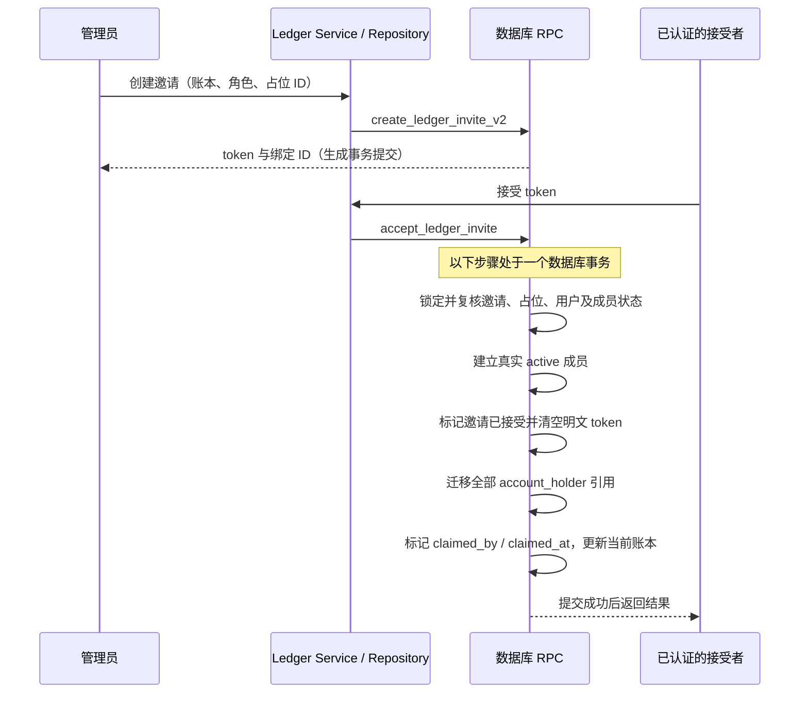

# Issue #798：账本占位成员与账户持有人设计

> **#809 变更（匿名邀请已废弃）**：[#809](https://github.com/toushobun/kuranote/issues/809) 起不再支持新建匿名邀请，统一为「邀请成员 = 待邀请成员 + 专属链接」。设置页只保留一个「邀请成员」入口：填写名字（必填）与角色，先创建待邀请成员，再生成绑定该成员的专属链接；「添加待邀请成员」入口与匿名「待接受邀请」展示均已移除，成员区块只剩「成员」与「待邀请成员」两类。数据库层由表级 CHECK `ledger_invite_pending_requires_placeholder`（待接受邀请必须有 `placeholder_id`）与 `create_ledger_invite_v2` 的 `placeholder_required` 兜底；项目未上线，migration 直接撤销了残留的匿名待接受邀请。`accept_ledger_invite` 的匿名分支保留不动，只剩历史数据能走到。下文中关于匿名邀请的描述保留为历史设计记录，以本段为准；成员列表的现行展示见「成员列表与邀请展示」。

> **#811 注（认领沿用名字与成员重名）**：[#811](https://github.com/toushobun/kuranote/issues/811) 起增加两条规则。1）认领绑定邀请后，`accept_ledger_invite` 在同一事务内、写入认领标记之后，把接受者在该账本的显示名（`ledger_member_display_setting.display_name`）设为待邀请成员的名字；之后成员仍可按现有功能修改，幂等重放不覆盖；账号全局昵称 `app_user.display_name` 不变。2）同一账本内，未认领待邀请成员的名字与 active 成员的有效显示名（账本内显示名，为空时回退账号昵称）不能相同，比较口径与占位名字相同（去除首尾空白后精确比较，不做大小写折叠）：新建、改名、导入 ensure 与成员重名返回 `placeholder_name_member_conflict`；成员把显示名改成未认领待邀请成员的名字返回 `display_name_placeholder_conflict`。因此下文「已认领行不占用名字、允许与新占位重名」在认领后通常不再成立：认领后该名字成为成员的显示名，新占位按成员重名被拒，直到成员改名。修改账号全局昵称造成的重名不做检查，属于已知边界。

## 背景与范围

本文为待人工确认的设计稿，关联 [#798](https://github.com/toushobun/kuranote/issues/798)、[#780](https://github.com/toushobun/kuranote/issues/780)、[#797](https://github.com/toushobun/kuranote/issues/797) 与 [#431](https://github.com/toushobun/kuranote/issues/431)。本次只新增本文档，不实现功能、不创建 migration、不修改业务文件、不勾选 #798 的 TODO，也不创建后续实现 Issue。文档提交或 PR 合并不代表设计已经通过人工确认。

历史账单的账户持有人可能尚未注册或加入账本。占位成员用于保存这类归属信息，管理员之后可生成绑定占位的邀请，由经过认证的接受者一次性接管其账户持有关系。

## 已核对的现状

核对基线为 `main` 的 `d071b022`（PR #799 已合并），数据库事实按 migrations 的最终有效定义判断，不只看首次建表文件。

| 位置                                                                                                    | 当前行为                                                                                                                                                                                                                     |
| ------------------------------------------------------------------------------------------------------- | ---------------------------------------------------------------------------------------------------------------------------------------------------------------------------------------------------------------------------- |
| `20260531072350_initial_schema.sql`                                                                     | `ledger_member.status` 为 `active / invited / removed`；`user_id` 非空且引用 `app_user`，`invited` 不是无身份占位。                                                                                                          |
| `20260602162903_add_account_holder.sql`                                                                 | `account_holder.user_id` 非空、引用 `app_user`；触发器要求持有人是同账本 active 成员且用户有效。                                                                                                                             |
| `20260716210000_restore_ledger_invite_token.sql`                                                        | 邀请仍无目标用户身份。除摘要与状态等字段外，已有明文 `invite_token`；`ledger_invite_token_lifecycle_check` 要求有效期间非空，accepted/revoked 后置空。表启用 RLS，客户端无直接读写权限，只能经 RPC。                         |
| 同上及 `20260715150000_improve_ledger_invite_roles_and_replacement.sql`                                 | 当前生成 RPC 为 `create_ledger_invite_v2(p_ledger_id uuid, p_role text default 'member')`，没有目标用户或占位参数。旧 `create_ledger_invite` 与 `replace_ledger_invite` 已删除；撤换是先 revoke、再 create 两个独立事务。    |
| `20260717105000_fix_ledger_invite_ambiguous_column.sql`                                                 | `accept_ledger_invite(text)` 的后续修订保留 token 清空、成员创建与当前账本切换，并修复返回列歧义。普通邀请遇到 active 成员返回 `already_member`。                                                                            |
| `20260711180000_add_ledger_member_permission_model.sql`                                                 | account / account_holder 的写 RLS 与管理权限触发器要求 owner/admin；不能只看账户 RPC 中较宽的 `current_user_can_write_ledger` 判断。                                                                                         |
| `20260916090000_limit_account_holder_to_single.sql`、`20260917090000_scope_account_name_uniqueness.sql` | 账户最多一位持有人，数据库通过 `account_holder_single_user_unique(account_id)` 兜底；未归档账户唯一性由内部表 `account_name_scope` 的延迟唯一约束实现，维度含账本、规范化名称、类型、币种、持有人。                          |
| `20260922090000_record_initial_account_balance.sql`                                                     | 最新 `create_account_with_holders` 还调用 `record_account_initial_balance`，扩展持有人时不能覆盖掉该行为。                                                                                                                   |
| #797 / PR #799                                                                                          | `ImportHolderMapping` 为姓名到 `string \| null` 的映射；`collectHolderMappingCandidates` 收集不能唯一匹配 active 成员的姓名；显式映射优先于显示名匹配，执行前重新校验 userId。明确无持有人不警告，未覆盖姓名保持 #780 兜底。 |
| `useDataImportForm`、`dataImportExecutionService`                                                       | 浏览器解析、逐批提交，Service 逐执行单元记录成功或失败；不存在整个文件的数据库事务，失败不会自动撤回此前成功写入。                                                                                                           |
| #431                                                                                                    | 成员列表已有匿名「待接受邀请」项；它不是 `ledger_member`，不能凭邀请伪造被邀请者姓名。                                                                                                                                       |

`ledgerInviteRepository.create` 当前只传 `p_ledger_id` 与 `p_role`，Service 返回 `{ inviteId, role, token }`。本方案显式扩展这条链路，保留最新 token 生命周期，不恢复旧 RPC。

## 既定决策

1. 新增最小表 `ledger_placeholder_member(id, ledger_id, display_name, claimed_by, claimed_at, created_by, created_at)`，不复用或伪造 `app_user`。占位先于邀请存在、被持有关系长期引用；邀请是完成或撤销后终止的一次性动作记录，二者分表。
2. `ledger_invite.placeholder_id` 可空，管理员生成邀请时可绑定占位；同一占位最多一条未接受、未撤销的有效邀请。接受绑定邀请时自动认领并整体迁移持有关系。
3. `account_holder.user_id` 改为可空，新增可空 `placeholder_id`，每行必须且只能指定其中一个。无持有人仍表示不存在 `account_holder` 行。
4. 仅 owner/admin（与 `canManageMembers` 一致）能创建、改名或删除占位。入口为成员管理页「添加待邀请成员」与导入映射下拉「新建待邀请成员」。（#809 注：成员管理页的入口已合并为「邀请成员」，创建占位的同时生成专属链接。）
5. 被任意 `account_holder` 引用时禁止删除，占位所关联的账户须先改为其他持有人或无持有人；归档账户也算引用。
6. 占位不算账本成员、不计成员数、不能登录、无查看或记账等权限；在成员列表显示「待邀请」，可作为账户持有人。
7. 已经是该账本成员的人接受新的绑定邀请直接失败，不自动合并。成功接受同一邀请后的网络重试另按幂等成功处理，不属于再次认领。
8. 导入中的创建意图只保存在浏览器，点击「继续导入」后随首次执行请求批量提交；此前取消无写入。同账本已有同名未认领占位时复用，不重复创建。同账本未认领占位的显示名去除首尾空白后精确唯一，不做大小写折叠；已认领历史行不占用名字。

## 数据结构与约束

### `ledger_placeholder_member`

| 字段           | 类型与约束                                                 | 含义                                                                                                                                                 |
| -------------- | ---------------------------------------------------------- | ---------------------------------------------------------------------------------------------------------------------------------------------------- |
| `id`           | `uuid primary key default gen_random_uuid()`               | 独立的占位标识，永远不是 userId。                                                                                                                    |
| `ledger_id`    | `uuid not null references ledger(id) on delete restrict`   | 所属账本，不允许编辑或跨账本移动。                                                                                                                   |
| `display_name` | `text not null`                                            | 保存去除首尾空白后的名字，check 要求非空且等于 `btrim(display_name)`。不做大小写折叠或别名合并；同账本未认领行之间精确唯一，仅此字段可在认领前改名。 |
| `claimed_by`   | `uuid null references app_user(id) on delete restrict`     | 认领的已认证真实用户，只能由接受邀请流程设置。                                                                                                       |
| `claimed_at`   | `timestamptz null`                                         | 与 `claimed_by` 同时为空或同时非空。                                                                                                                 |
| `created_by`   | `uuid not null references app_user(id) on delete restrict` | 由 RPC 使用 `auth.uid()` 填写，不接收客户端指定。                                                                                                    |
| `created_at`   | `timestamptz not null default now()`                       | 创建时间，由数据库填写。                                                                                                                             |

必要约束与索引：

- `unique (id, ledger_id)`，供下游复合外键保证同账本引用。
- `check ((claimed_by is null) = (claimed_at is null))`。
- 部分唯一索引 `ledger_placeholder_member_unclaimed_name_unique (ledger_id, display_name) where claimed_by is null`，同时服务未认领列表与导入同名查找，替代原普通姓名索引。
- 普通索引 `(claimed_by) where claimed_by is not null`，支持引用检查与认领审计。
- 启用 RLS。禁止直接 INSERT / UPDATE / DELETE；未认领列表可由 active 成员按账本读取。审计列不可被管理页编辑，认领状态不可回退。

姓名约束在数据库中具体表达为：

```sql
check (display_name <> '' and display_name = btrim(display_name))

create unique index ledger_placeholder_member_unclaimed_name_unique
on public.ledger_placeholder_member (ledger_id, display_name collate "C")
where claimed_by is null;
```

RPC 与 Service 都先去除首尾空白；数据库存规范化后的名字，唯一索引使用确定性的 `"C"` 比较，精确区分大小写，不用 `lower()` 或 `citext`。RPC 的同名查询使用相同比较口径。占位没有邮箱等第二身份信息，未认领重名会使候选无法区分，故由数据库兜底禁止。唯一范围只覆盖未认领行：已认领行保留关联历史，但不再出现在候选中，允许与新占位重名；认领事务提交后才释放该名字，回滚则仍占用。不同账本不互相限制。

不增加 role、登录标识、邮箱、auth 身份或 `ledger_member` 行。认领后保留占位行作为关联历史，退出待邀请列表和持有人候选；其删除不作为未认领占位删除功能的一部分。

### `ledger_invite`

新增 `placeholder_id uuid null`，复合外键 `(placeholder_id, ledger_id) references ledger_placeholder_member(id, ledger_id) on delete restrict`。NULL 保持匿名邀请语义（#809 注：新建邀请已不允许为 NULL，CHECK 只允许已接受或已撤销的邀请为 NULL）。绑定一经创建不可改绑；换人要撤销旧邀请并重新创建。

数据库最终兜底为部分唯一索引，不能用跨行 CHECK 表达：

```sql
create unique index ledger_invite_one_pending_placeholder
on public.ledger_invite (placeholder_id)
where placeholder_id is not null
  and accepted_at is null
  and revoked_at is null;
```

另加 `(placeholder_id) where placeholder_id is not null` 普通索引，用于历史引用检查及删除未认领占位时处理已撤销邀请；部分唯一索引只覆盖有效行，不能代替这个用途。

保留 `token_hash` 唯一性、accepted/revoked 配对约束、`invite_token` 长度及生命周期约束，不向客户端开放表权限。RPC 内检查同账本、未认领和已有绑定，提供可理解的业务错误；部分唯一索引兜底并发，不以「先查再插」代替唯一约束。

### `account_holder` 与账户唯一性

- 解除 `user_id NOT NULL`，保留对 `app_user` 的外键及删除限制。
- 新增 `placeholder_id uuid null`，复合外键 `(placeholder_id, ledger_id)` 指向占位的 `(id, ledger_id)`，删除限制为 RESTRICT。
- 新增 `check ((user_id is not null) <> (placeholder_id is not null))`，拒绝双空或双有。
- 保留 `account_holder_single_user_unique(account_id)`、`unique(account_id, user_id)` 以及账户同账本外键，不引入多持有人功能。单账户唯一索引已覆盖占位重复持有，无须再加 `(account_id, placeholder_id)` 唯一索引。
- 新增 `(placeholder_id) where placeholder_id is not null` 索引，服务全量认领、删除检查与关联查询。
- 扩展 `validate_account_holder_active_member()`：用户分支仍要求同账本 active 成员、active 用户；占位分支要求同账本且未认领，并锁定占位，避免认领完成后又新增旧占位引用。双分支都不允许跨账本更换 `account_id / ledger_id`。

必须同步扩展内部 `account_name_scope`，否则两个不同占位的 `user_id = null` 会被错误合并到无持有人命名空间：

- 新增 `holder_placeholder_id uuid null`，保留 `holder_user_id`。
- 新增至多一个非空的 CHECK（此投影允许双空，代表无持有人）。
- 将 `account_active_name_unique` 改为 `unique nulls not distinct (ledger_id, name, type, currency, holder_user_id, holder_placeholder_id) deferrable initially deferred`。
- 修改 `sync_account_name_scope(uuid)` 投影两种标识，沿用 `lower(account.name)`、类型与币种规则；`refresh_account_name_scope()` 的触发时机已包含所有持有人 UPDATE，无须增加重复触发器。
- 该表继续启用 RLS、禁止客户端与 service_role 直接访问；内部同步函数继续撤销客户端 EXECUTE 权限。
- 认领只更新既有 `account_holder` 行的身份列与更新审计列。账户 ID、余额、名称、交易外键、创建人和历史记账人保持原事实；「历史账户迁移」通过稳定账户 ID 的持有人变更实现，不伪造过去的操作人，也不改 transaction consumer 等其他身份字段。

后续 migration 应在单事务中扩展字段、约束、投影与函数，并从旧 userId 数据回填投影；旧持有行不生成占位。已部署的历史 migration 不改写。本次不生成 migration 或 schema 快照。

## 权限与 RLS

占位能力归属账本管理，不成为新的授权主体。`current_user_has_ledger_role`、`current_user_can_manage_ledger`、`current_user_can_write_ledger` 继续只查询真实 active 成员及有效用户，成员计数继续来自 `ledger_member`。

| 表 / policy                                                                                 | 后续处理                                                                                                                                                                                                                                                 |
| ------------------------------------------------------------------------------------------- | -------------------------------------------------------------------------------------------------------------------------------------------------------------------------------------------------------------------------------------------------------- |
| 新表 `ledger_placeholder_member`                                                            | 新增 `ledger_placeholder_member_select_active_member`：仅同账本 active 成员且 `app_user.status = 'active'` 可读。只授予必要 SELECT；不创建客户端写 policy，撤销写权限，包括改名在内的写入必须走受控 RPC，不能因允许编辑 display_name 而开放直接 UPDATE。 |
| `ledger_invite`                                                                             | 保持 RLS 与无直接访问权限，不新增普通 SELECT/写 policy。token 只经现有受控 RPC 按原权限返回。                                                                                                                                                            |
| `account_holder_select_active_ledger_member`                                                | 保留访问者必须为真实 active 成员的条件；占位持有人不能产生访问资格。读取映射增加占位分支，不能把该 policy 改为检查持有人登录。                                                                                                                           |
| `account_holder_insert_admin`、`account_holder_update_admin`、`account_holder_delete_admin` | 保留 owner/admin 门槛，继续对 UPDATE 同时校验旧行与新行账本；数据库 FK、CHECK、校验触发器补足两种持有人有效性。不开放普通成员 UPDATE policy 来完成认领。                                                                                                 |
| `account_insert_admin`、`account_update_admin`                                              | 保持原规则；绑定占位不扩大账户管理权限。                                                                                                                                                                                                                 |
| `ledger_member_insert_admin` 及其他成员策略                                                 | 不增加占位分支，接受邀请仍走现有受控成员创建通道；占位不插入 invited 成员。                                                                                                                                                                              |
| `account_name_scope`                                                                        | 保持完全内部化，唯一性投影扩展不会扩大读取范围。                                                                                                                                                                                                         |

Service 与数据库均独立检查身份、active 资格、角色及归属。数据库 SECURITY DEFINER 使用固定 `search_path = pg_catalog, pg_temp`、完整 schema 限定名和 `auth.uid()`，不相信客户端传来的操作用户。新增管理 RPC 撤销 PUBLIC/anon EXECUTE，只授予 authenticated；预览 RPC 的既有 anon 权限不扩散到其他操作。

### 认领时的触发器权限例外

`account_holder_require_management_permission` 调用 `enforce_ledger_management_permission()`；普通 member/viewer 即使通过 SECURITY DEFINER 接受邀请，触发器仍会看到 `auth.uid()` 并拒绝其管理操作。因此后续必须修改该函数，增加严格限定的认领分支：

- 仅允许 `account_holder` 的 UPDATE，将 OLD 的占位引用改成 `NEW.user_id = auth.uid()` 且 `NEW.placeholder_id = null`。
- id、ledger_id、account_id、role、share_ratio、created_by、created_at 全部保持一致，只允许身份列与既有更新审计列变化。
- 必须存在同账本同占位的已接受邀请，`accepted_by = auth.uid()`，且占位仍未标记认领；接受流程先在同一事务写入 accepted 状态，再迁移引用，最后标记占位。邀请表不能被该用户直接修改。
- 同时检查真实用户已是该账本 active 成员、用户有效，并持有相关锁。不得仅凭一个客户端可设的 GUC 标记豁免权限，也不得复用账户余额更新的豁免分支。
- 未命中该窄分支时继续走原 owner/admin 判断，其他表完全沿用原行为。RLS 仍不赋予普通成员直接 UPDATE 权限。

这样 viewer 也能认领，但认领不会让其获得编辑账户的权限。成员插入沿用 `enforce_ledger_member_management_permission()` 的邀请接受通道；不能为占位创建开放该通道。

## RPC 改动

### 邀请生成的明确契约

拟将现存函数替换为以下签名（只展示契约，不是本次要执行的 SQL）：

```sql
create_ledger_invite_v2(
    p_ledger_id uuid,
    p_role text default 'member',
    p_placeholder_id uuid default null
)
returns table (
    invite_id uuid,
    token text,
    ledger_name text,
    invite_role text,
    placeholder_id uuid
)
```

NULL 或省略参数创建匿名邀请，非空参数创建绑定邀请。（#809 注：签名不变，但 NULL 或省略时在权限校验之后返回 `placeholder_required`，不再创建匿名邀请。）角色继续使用现有 `admin / member / viewer` 校验，不因为占位而增加角色。

RPC 在锁定账本和占位后检查：操作人 active 且 owner/admin、账本未归档、占位属于该账本且未认领、没有有效绑定邀请。插入时写入 `placeholder_id`。重复绑定返回稳定 `placeholder_invite_pending` 冲突；部分唯一索引提供不可绕过的并发兜底，约束异常在 RPC 或 Repository 精确转换，不能解析数据库英文 message。

增加参数会产生新的 PostgreSQL 函数签名；后续 migration 必须删除旧 `(uuid, text)` 定义再创建新定义，并重设授权，避免保留重载造成 PostgREST 默认参数歧义。原两参数命名调用可使用新增参数的默认值，但返回 Row 校验及生成类型必须同步更新，不能只改 SQL。

完整调用链：

- `ledgerInviteRepository.ts` 的 `create` 增加 `placeholderId: string | null`（或等价具名输入），传 `p_placeholder_id`，读取并校验返回值，`CreateLedgerInviteResult` 成功分支增加 `placeholderId`。
- `ledgerInviteService.ts` 的 `CreateLedgerInviteInput` 增加可选 `placeholderId`，归一化为 NULL；权限与占位状态预检后调用 Repository，`CreatedLedgerInvite` 增加 `placeholderId: string | null`。RPC 再校验，预检不替代数据库保证。
- `adapter/next/actions/ledgerInvite.ts` 的 `createLedgerInvite` 通过模块 schema 解析可选 UUID，再传给 Service；成功结果带绑定标识供页面更新，失败继续返回 `BaseActionState` 派生状态。
- 成员管理页的占位行生成邀请时传该行 ID；现有通用邀请入口省略 ID。创建反馈、持久化列表、复制链接状态均携带绑定标识，不以显示名或 URL fragment 作为数据库绑定的事实来源。
- `list_pending_ledger_invites` 返回 `placeholder_id`；其 Repository Row、`PendingLedgerInvite`、loader 和页面 view model 一并扩展。token 仍只向有管理权限的人返回。

### 需要修改的现有函数清单

| 函数                                     | 具体变更                                                                                                                                                                                                                                                                                                  |
| ---------------------------------------- | --------------------------------------------------------------------------------------------------------------------------------------------------------------------------------------------------------------------------------------------------------------------------------------------------------- |
| `create_ledger_invite_v2`                | 如上，增加可选绑定参数、返回绑定 ID、权限/状态检查及锁。                                                                                                                                                                                                                                                  |
| `revoke_ledger_invite`                   | 保留原参数；与接受/删除统一锁顺序，撤销写 `revoked_at/by` 并清空 `invite_token`。不清除历史 `placeholder_id`，有效绑定因 revoked 状态立即失效。                                                                                                                                                           |
| `accept_ledger_invite`                   | 保留 token 入参，增加绑定分支、已有成员冲突、全量持有人迁移、占位认领标记与重试判断；返回原 ledger 字段及 result，并增加 `placeholder_id` 供调用链明确识别认领结果。                                                                                                                                      |
| `list_pending_ledger_invites`            | 增加 `placeholder_id` 返回列；继续过滤 accepted/revoked，权限与 token 可见性保持现状。改变 RETURNS TABLE 需删除旧定义并重建授权。                                                                                                                                                                         |
| `get_ledger_invite_preview`              | 保留 `p_token text` 入参及原受控返回字段，新增 `is_placeholder_bound boolean`、`placeholder_display_name text`（可空）。有效绑定邀请实时读取占位当前 display_name；匿名邀请返回 false / null。识别缺失/已认领等无效状态，失效邀请不返回占位姓名；不得返回 claimed_by、账户列表、金额或其他个人/财务信息。 |
| `create_account_with_holders`            | 在既有参数末尾增加 `p_placeholder_id uuid default null`；用户数组仍最多一个，且不能与占位同时指定。占位归属/状态检查、锁和插入持有行均在同一事务；保留初始余额记录逻辑。                                                                                                                                  |
| `update_account_with_holders`            | 同样增加可选占位参数；显式处理用户/占位/无持有人三态，删除或替换旧占位引用不能沿用仅判断 user_id 的删除条件，避免 NULL 比较或 active 用户过滤漏删。                                                                                                                                                       |
| `update_account_with_balance_adjustment` | 这是账户 Repository 当前实际调用的编辑 RPC；在现有 `p_adjustment_note` 后增加 `p_placeholder_id uuid default null`，传递给扩展后的 `update_account_with_holders`，保留资料更新与余额调整的单事务。Repository 输入、schema 与生成类型同步扩展，不能只改底层函数。                                          |
| `validate_account_holder_active_member`  | 扩展为两种身份校验及占位锁定；它是触发器函数，不是对外 RPC。                                                                                                                                                                                                                                              |
| `enforce_ledger_management_permission`   | 增加上节限定的认领迁移例外，仍不对客户端授予 EXECUTE。                                                                                                                                                                                                                                                    |
| `sync_account_name_scope`                | 投影新增占位 ID；继续只允许内部调用。                                                                                                                                                                                                                                                                     |

> **#808 注（非活跃持有人保留）**：A 阶段实现 `update_account_with_holders` 的三态删除时去掉了「只删除 active 成员持有行」的限制，导致编辑账户时非活跃成员持有人被误删。[#808](https://github.com/toushobun/kuranote/issues/808) 修复后：提交「无持有人」时保留非活跃成员（成员非 active 或账号非 active）的持有行，与表单「非活跃，保存时保留」一致；提交新的成员或占位时仍替换原持有人。

账户三个 RPC 同样需删除旧签名、同步内部调用并重建授权，不能留下带默认参数的歧义重载。修改 `accept_ledger_invite` 和预览的返回列时也需按删除重建方式更新定义及授权。

`refresh_account_name_scope` 无须改变函数体，保留现有触发调用；`record_account_initial_balance`、三个角色判断函数及成员权限触发器不增加占位身份逻辑。上述函数与授予权限均需在实现阶段按最终定义回归，不能复制早期 migration 覆盖后续修复。

**不恢复 `replace_ledger_invite` 或旧 `create_ledger_invite`。** 撤换绑定邀请依然是两步：先 revoke 旧邀请，旧绑定随之失效；再 create 新邀请，必须重新传同一个 `p_placeholder_id` 才继续绑定该占位。第二步失败时旧邀请不会复活，占位保持未认领、无有效邀请；页面允许重试生成。不能把这两步描述为原子替换，也不能删除旧行来绕过唯一索引。

### 新增的最小管理 RPC

新增函数名称为设计建议，后续实现需在 ledger 模块统一维护业务错误：

- `create_ledger_placeholder_member(p_ledger_id uuid, p_display_name text)`：仅 owner/admin 可在目标账本立即创建占位；规范化后与已有未认领占位重名时返回 `placeholder_name_conflict`，不能在管理页悄悄复用成另一个人。
- `ensure_ledger_placeholder_members(p_ledger_id uuid, p_display_names text[])`：导入专用批量创建/复用，返回各输入名对应占位 ID。仅 owner/admin 可调用；事务内按账本加锁、校验全部输入与权限，再统一写入。输入姓名规范化后去重，已有同名未认领占位直接复用；没有则创建，不逐个网络调用。若发生不能重新读取并复用的姓名唯一性冲突，返回 `placeholder_name_conflict` 并整批回滚；校验失败也整批回滚，不透出原始唯一约束错误。正常同名复用是成功结果，不作为错误。
- `rename_ledger_placeholder_member(p_ledger_id uuid, p_placeholder_id uuid, p_display_name text)`：仅同账本 active owner/admin 可调用，按账本 → 占位顺序加锁，仅允许 `claimed_by is null` 时更新 `display_name`。规范化后非空、同账本未认领名字唯一；与其他占位重名返回 `placeholder_name_conflict`，已认领返回 `placeholder_already_claimed`；改为自身现有名字可幂等成功。不允许改 ledger_id、认领状态或审计字段，账户引用与邀请绑定/token 均保持不变。
- `delete_ledger_placeholder_member(p_ledger_id uuid, p_placeholder_id uuid)`：锁定未认领占位，检查任意持有引用；有引用返回 `placeholder_in_use`。无引用时在同一事务撤销有效绑定邀请并清 token，再将该未认领占位的已撤销邀请 `placeholder_id` 置空，最后删除占位。不删除邀请记录；RESTRICT 外键防止遗漏引用。删除确认须说明其绑定链接也会失效。已认领行不走此入口。

创建、批量 ensure 与改名共用姓名规范化和安全错误契约。RPC 精确捕获姓名唯一索引对应的约束冲突，转换为稳定业务 code；Repository / Service 将 `placeholder_name_conflict`、`placeholder_already_claimed` 转为 `ConflictError` 和可展示文案，不返回原始数据库错误或约束名称。

改名提交后 Action 刷新成员列表、账户持有人候选与导入候选；邀请预览每次通过 `get_ledger_invite_preview(p_token text)` 关联占位表读取当前名字，不把名字快照存进邀请、链接参数或长期缓存。预览的 Repository Row、Service/schema、loader 与前端类型同步扩展上述两个返回字段。已打开的预览/候选在重新获取焦点、重新进入或提交前刷新，不继续展示已知过期名称。

没有单独的客户端「认领占位」RPC，认领只发生在 `accept_ledger_invite` 中，接受者不能提交任意 userId 或自行挑选占位。

## 认领时序、事务与并发



接受绑定邀请的具体顺序：

1. 验证登录、active 用户与 token 格式，通过 hash 找到候选邀请；首次读取只用于定位，不作为状态判断依据。
2. 在同一事务取得账本锁，再按顺序锁定占位、邀请、相关成员行、按 ID 排序的账户及持有行，重新读取并复核未归档、未撤销、绑定不变、占位未认领。
3. 先处理同邀请幂等重试：仅当 `accepted_by = auth.uid()` 且对应占位 `claimed_by` 相同、迁移已完整完成时返回成功，不重复更新账户或认领时间，也不重新授予被移除的成员资格。其他人重放已接受 token 一律拒绝。
4. 对尚未接受的绑定邀请，查询接受者该账本非 removed 成员行：active 或 invited 均视为已有成员并返回 `placeholder_claim_existing_member`，不自动激活、覆盖或合并；removed 是历史记录，不赋予现有成员身份。匿名邀请保留原有行为。
5. 经既有邀请通道创建 active 成员，角色来自邀请。写入邀请 accepted 字段并清空 token，为管理权限触发器提供只能由受控 RPC 写出的认领事实。
6. 更新所有 `account_holder.placeholder_id = 目标 ID` 的行（含归档账户）：`user_id = auth.uid()`、`placeholder_id = null`，保留账户及持有行 ID。同步名称投影；不能只迁移当前页面显示的账户。
7. 确认该占位无剩余持有引用，写 `claimed_by / claimed_at`，完成现有当前账本切换。延迟唯一约束在事务提交前通过后才返回成功。

任何一步失败，成员插入、邀请 accepted/token、持有引用、名称投影、占位标记和当前账本切换全部回滚。认领失败不能吞异常后提交部分迁移。名称唯一冲突返回明确 `ConflictError`，不自动重命名或合并账户。

### 并发边界

- 占位创建/改名、邀请生成/撤销/接受、占位删除、导入批量 ensure 及绑定占位的账户写 RPC 统一采用账本 → 占位（多个按 ID 排序）→ 邀请 → 成员 → 账户（按 ID 排序）的锁顺序。接受匿名邀请也取得同账本锁，防止同一用户同时通过普通邀请加入又认领占位。
- 账户更新涉及旧、新占位时锁定两者后再次确认当前持有行；发现锁前读取的旧引用已变化则回滚并提示重试，不能继续使用旧快照。应用不能把多个 Supabase 调用当成同一数据库事务。
- 改名与认领在同一账本/占位锁上串行化：认领先提交则改名拒绝，改名先提交则预览读取新名；占位 ID 的认领目标不变。创建、改名、ensure 同时抢占相同名字时由姓名部分唯一索引兜底，按各 RPC 契约返回冲突或复用。
- 部分唯一索引阻止并发生成第二条绑定邀请；接受与撤销竞争时只有先完成者生效，后者读取锁后的状态给出稳定结果。
- 占位引用校验必须取锁，FK 单独不能证明「尚未认领」。直接管理 DML 仍受 RLS、触发器和 FK 保护；若与 RPC 锁顺序产生死锁，数据库回滚失败事务并转换为可重试冲突，不能绕过校验继续执行。后续并发测试必须覆盖直接 DML 路径。
- 不能把「当前没有成员行」的查询当作并发保护。现有非 removed 成员唯一索引仍是最后防线；绑定分支不能沿用会更新现有成员的 UPSERT 来掩盖竞争。并发创建成员命中唯一约束时整次认领回滚为冲突。
- 成员状态、权限、占位状态的 Service 预检只改善反馈；数据库在持锁后重新判断。不得以提高认领成功率为由绕过已有成员冲突规则。

> **#816 注（并发冲突与预览）**：[#816](https://github.com/toushobun/kuranote/issues/816) 起，上述「转换为可重试冲突」由应用层统一落地：邀请生成 / 撤销 / 接受、待邀请成员管理与 ensure、账户新建 / 编辑、成员设置的 Repository 在 RPC 失败且未匹配业务 detail 时，按 SQLSTATE `40P01`（死锁）/ `40001`（序列化失败，包括接受邀请时的 `account_holder_changed`）抛出 `ConflictError`（409，code `concurrent_modification`，文案「数据正在被其他操作修改，请稍后重试。」），日志只记录 code 与 operation；已有更具体 detail 映射的（账户编辑的 `account_holder_changed`）优先沿用原映射。锁顺序本身不变（账本行锁仍为 `FOR UPDATE`，经评估不改）。同时，`get_ledger_invite_preview` 对绑定邀请把 active 或 invited 的未移除成员行都显示为 `already_member`，与上文第 4 步的接受结果一致；匿名历史邀请不变。

## 服务端分层落点

新逻辑落在 `internal/ledger`，不建立新的顶级能力模块、UseCase 层或通用身份系统。占位与邀请、成员管理同属一个账本生命周期。

| 层 / 模块                                     | 职责                                                                                                                                                                                                                                                                                                                   |
| --------------------------------------------- | ---------------------------------------------------------------------------------------------------------------------------------------------------------------------------------------------------------------------------------------------------------------------------------------------------------------------- |
| ledger 的 `schema.ts` / `entity/` / `errors/` | schema 校验账本/占位 UUID、名字及请求大小，推导公共类型；共享占位摘要与邀请绑定类型经 `index.ts` 导出。错误集中定义稳定 code 与安全文案，不泄露原始 SQL。                                                                                                                                                              |
| ledger 的 Service                             | 增加最小 `ledgerPlaceholderMemberService`，提供 list、create、rename、ensureForImport、delete 窄接口；负责真实成员与角色校验、业务编排。`ledgerInviteService` 扩展绑定、错误映射与接受结果；接受前独立验证登录和 active 用户，通过受控预览/检查契约进行状态预检，但不要求接受者预先属于账本，事务内判断仍由 RPC 重做。 |
| ledger 的 Repository                          | 是该模块唯一接触 Supabase 的层；执行占位 Query/RPC、邀请 RPC，校验 Row、转换数据库异常。原子认领封装在一个 RPC，不能拆成多次 Repository 写操作。                                                                                                                                                                       |
| `adapter/next/`                               | loader 通过请求 Container 直接读 Service；Action 校验登录、schema，调用 Service、revalidate；失败返回现有状态协议给 `FailureFeedbackDialog`，不用失败 redirect。                                                                                                                                                       |
| Controller / Router                           | 当前页面交互优先沿用 Action，不为占位新增不必要的 HTTP API。若已有 HTTP 调用需要扩展，由 Controller 读取 schema 结果、调用 Service、返回成功状态；Router 只登记路由并挂统一认证、错误处理与同源校验。                                                                                                                  |
| `internal/account`                            | 扩展账户 holder 类型、Repository 读取、表单和创建/编辑输入为真实成员 / 占位 / 无持有人。账户 Service 经 ledger 根入口读取/校验占位，不深度导入 ledger Repository。                                                                                                                                                     |
| `accountImportService`                        | 将 `holderUserId` 改为带判别字段的持有人引用（或等价互斥结构），保留窄 `createAccount / loadContext` 接口；不能把占位的空 user_id 映射为无持有人。候选 active 用户与占位分开表达。                                                                                                                                     |
| `dataImportExecutionService`                  | 依赖 ledger 导出的导入 ensure 窄 Service 与 account 窄 Service；先校验整份映射，再批量解析创建意图，最后逐单元执行。不直接读写 ledger/account 表。                                                                                                                                                                     |
| `container.ts`                                | 作为唯一组合根装配 Repository/Service，复用请求级 ledgerAccessService；依赖保持 dataImport → account/ledger、account → ledger，ledger 不反向调用 account Service。数据库原子迁移跨表不等于 TS 模块互相依赖。                                                                                                           |

账户持有人读路径还需覆盖筛选、列表显示、导出显示名及依赖 AccountHolder 的其他视图，避免 nullable userId 被误用于用户查询、头像或成员计数。占位没有用户资料，名称取自占位表；已认领账户按真实用户的现有展示逻辑呈现。金额与成员统计不得因占位展示多算成员或重复账户。

## 数据导入契约与前后端流程

### 扩展 `ImportHolderMapping`

需要扩展值类型，不能把占位 UUID 塞进原来的 userId 字符串。建议 schema 推导如下判别联合，四种意图互斥：

```typescript
type ImportHolderMappingValue =
  | { kind: "member"; userId: string }
  | { kind: "none" }
  | { kind: "placeholder"; placeholderId: string }
  | { kind: "newPlaceholder"; displayName: string };

type ImportHolderMapping = Record<string, ImportHolderMappingValue>;
```

前三种是可执行引用，最后一种只是待创建意图。保留已有占位选项，以便文件姓名与当前占位名字不同（包括占位已改名）时仍可按 ID 明确指定。新建名字默认采用文件姓名；认领前改名通过成员管理页的专用入口完成，导入中的创建意图不隐式改名。

旧 `string | null` 在输入边界可归一化为 member / none，兼容已打开的页面；模块内部只用一种新契约，不长期维护两套解析规则。无法识别的 kind、额外冲突字段、非法 UUID、过量/空姓名在写入前拒绝。映射缺少某姓名和显式 none 仍有不同含义。

`collectHolderMappingCandidates` 继续是零 I/O 纯函数，维持三类执行单元、转账同名去重计数及 active 成员精确匹配口径。占位不伪装成 `AccountImportHolder` 成员；存在同名占位时仍让用户在映射步骤确认，不按名字自动赋予用户身份。能唯一匹配真实成员的姓名保持 #797 的跳过行为。

### 执行流程及事务边界

1. loader 返回 active 成员、实时读取 display_name 的未认领占位摘要与 `canManageMembers`；候选以 ID 为值，不缓存旧名字，进入映射步骤及提交前刷新名称。下拉包含现有成员、现有占位、无持有人；仅 owner/admin 看到「新建待邀请成员」。选择新建只改本地状态，不调用创建 RPC。
2. 「取消导入」清空解析和映射状态，不提交请求、不创建占位；关闭映射页也不写入。禁用重复点击，开始后沿用既有不能撤销整个导入的语义。
3. 点击「继续导入」时，首次 `executeDataImportBatch` 请求携带第一批执行单元和整份映射，包含所有新建意图；不在选择下拉时预创建。服务端先完成格式、当前用户/账本/导入权限、全部 member/placeholder 引用以及新建权限校验，再发起任何写入。
4. Service 将新建意图的姓名去重，调用一次 `ensure_ledger_placeholder_members`。RPC 在单一事务内校验并批量创建或复用；失败则不写任何占位，也不执行第一批记录。已有同名未认领占位直接复用，数据库部分唯一索引保证至多一个；无法处理的姓名唯一性冲突按 `placeholder_name_conflict` 安全返回，不保留“多个同名占位”正常业务分支。
5. RPC 提交后获得姓名到 ID 的稳定映射，将 newPlaceholder 转为 placeholder；再执行当前批次，并在 Action 返回值中携带 `resolvedHolderMapping`。后续批次传已解析映射，不反复提交创建意图。Service 每批都重新校验归属、active 成员及占位未认领状态。
6. `resolveHolderUserId` 应调整为表达两种引用的 `resolveHolder`：显式映射优先；无映射时继续按 active 成员显示名精确匹配。明确选择占位或 none 不产生未匹配警告；遗漏姓名保持 #780 的未匹配警告与歧义失败行为。
7. 账户复用键包含持有人种类及 ID，如 `member:<id>`、`placeholder:<id>`、none，加上现有名称/币种匹配条件；不会因两个 UUID 恰好相同或 userId 为空而混用账户。数据库仍按含账户类型的完整唯一约束兜底，不顺带改写已有导入账户类型策略。

**事务承诺是「占位批量创建/复用」原子提交，后续账户及交易沿用现有分批、逐单元提交，不是整个导入原子提交。** 点击继续后若网络断开或全部记录失败，已创建但未引用的占位可能保留，可依既定删除规则由管理员处理。不能用前端补偿删除冒充回滚，否则可能删除已被其他账户或邀请使用的占位。若产品未来要求「导入任何失败都不留占位」，须另行设计导入事务能力，不属于本次 8 项决策。

导入重试时同名唯一占位由持锁 ensure 复用，避免重复创建；批量请求本身失败全部回滚。响应丢失后不盲目自动重试创建意图，先刷新候选重新确认，再按当前姓名查找并复用；原占位已改名、认领或删除时，姓名可能已释放或被另一个占位占用，不能声称跨这些变化仍有严格幂等性。已拿到占位 ID 后遇到被认领/删除，整批预检失败，不能自动换成该真实用户或静默新建。既有交易导入去重机制继续负责记录重复，本方案不宣称新增整文件 exactly-once 保证。

同名复用在账本锁内执行，防止两个导入请求同时各自创建。已确认的规则为去除首尾空白后精确比较、不做大小写折叠，Service 校验与 `ledger_placeholder_member_unclaimed_name_unique` 同时保证同账本未认领名字唯一。已选 placeholderId 的映射在改名后仍指向同一占位，只刷新显示名；未执行的 newPlaceholder 意图按提交时的名字创建/复用，不擅自猜测改名前后的身份。

## 成员列表与邀请展示

列表 view model 区分两种事实来源（#809 起匿名邀请行已移除）：

| 类型          | 展示与操作                                                                                                                          | 是否计入成员数       |
| ------------- | ----------------------------------------------------------------------------------------------------------------------------------- | -------------------- |
| active member | 真实成员，沿用头像、角色及成员设置                                                                                                  | 是，沿用现有计数口径 |
| placeholder   | 名称 + 链接状态：已生成链接时显示「等待加入」、角色与创建时间，可查看/复制/撤销；未生成（含撤销后）时显示「未生成链接」，可重新生成 | 否                   |

绑定邀请通过 `placeholder_id` 合并到对应占位行；撤销后占位行仍保留，状态回到「未生成链接」。找不到对应占位的邀请只会在读取竞态时出现，直接不显示，刷新后与数据库一致。接受成功后占位退出列表、真实 active 成员出现，成员数只因真实成员加入增加一次。

~~anonymous pending invite：沿用 #431 的匿名「待接受邀请」与角色、时间，不伪造姓名。~~（#809 已废弃）

「邀请成员」是两个独立事务：先创建待邀请成员，再生成绑定邀请。不新增把两步包成一个事务的 RPC。第 1 步重名时返回引导文案，不自动复用同名占位；第 2 步失败时占位保留，返回「已添加「XX」，但邀请链接生成失败，请在列表中重新生成」的部分成功文案，并刷新成员列表，由该行的「生成专属邀请链接」重试。

owner/admin 可见创建、改名、删除、生成/撤销绑定邀请按钮；其他 active 成员只读占位摘要，不获得 token 或管理操作。删除复用现有确认弹框，引用冲突提示先更换相关账户持有人。待邀请条目不提供登录、改成员角色、设记账消费者等真实成员功能。

`LedgerSettings`、邀请操作组件及其 hook 扩展判别类型；按项目 Atomic Design 与组件目录规则复用 MUI。文案集中维护，补充有/无绑定邀请、无权限、创建/改名重名冲突、改名后刷新及认领后的展示场景。若主区块结构变化，同时检查 loading/skeleton；不新增独立占位管理页面。绑定邀请的复制/分享按钮旁及邀请落地预览页明确展示「这是邀请你加入并接管 XX（占位显示名）的历史账户与交易记录」，其中 XX 以实时 display_name 替换；匿名邀请沿用普通加入文案，不能共用绑定邀请的接管说明。（#809 注：所有邀请都绑定名字后，复制区域与落地页统一改为「邀请你以「XX」的身份加入账本。加入后，记在「XX」名下的账户与记录会归到你名下。」，措辞不暗示一定存在历史账户，也不为判断有无账户扩展预览 RPC。）改名不改变 URL，后续打开同一链接看到新名字。此说明不改变历史记账人事实，也不扩张接受者角色权限。

## 与 #780 安全决策的关系

#780 否决的是通过导入凭空生成未认证用户身份。本设计的占位只有账本内部数据 ID，没有 auth.users/app_user、凭证、会话、角色或成员记录，任何权限查询都不会接受 placeholderId。创建和选择占位只记录资产归属标签，不授予任何人权限。

真实身份仍由现有认证系统建立，必须经有效 token、已认证用户和 `accept_ledger_invite` 才成为成员；认领人来自 `auth.uid()`，不按 display_name 或邮箱推断。绑定邀请是持有链接者可接受的邀请，不提供「此人确实是名字所指的人」的实名证明。管理员对生成和分享链接负责；绑定不会自动发送消息，链接预览不能泄露账户历史。这与伪造 app_user 的方案有明确的授权边界差异。

## 产品补充确认（原未决问题已定）

原四项未决问题已由产品确认，相关技术方案已同步到上文：

1. 同账本未认领占位 display_name 去首尾空白后精确唯一，不做大小写折叠；已认领历史行退出唯一索引，不占用新占位名字。
2. owner/admin 可在认领前改名，仅开放 display_name；已认领后拒绝修改，邀请预览和候选读取实时名字。
3. 绑定邀请明确提示「这是邀请你加入并接管 XX（占位显示名）的历史账户与交易记录」，并仅披露受控预览字段。（#809 注：文案已改为「以 XX 的身份加入」，见「成员列表与邀请展示」。）
4. 未认领占位永久保留。本设计不实现过期机制，管理员按需手动删除，被引用时禁止删除；不新增过期字段、定时任务或自动清理。

## 后续实现 Issue 拆分建议

设计人工确认后再创建实现 Issue，各 PR 以合并后的 main 为基础并独立验证；本次仅提出范围，不代建或勾选。

| 顺序与建议标题                                    | 范围 / 依赖                                                                                                                                                                        | 验收要点                                                                                                                                                                                                                                  |
| ------------------------------------------------- | ---------------------------------------------------------------------------------------------------------------------------------------------------------------------------------- | ----------------------------------------------------------------------------------------------------------------------------------------------------------------------------------------------------------------------------------------- |
| A：`feat: 新增账本占位模型及账户持有人数据库约束` | 前置为本文人工确认，姓名规则已确认。新表、FK/CHECK/索引（含未认领姓名唯一）、RLS、创建/改名/删除管理 RPC、账户 RPC 双身份、名称投影；预留邀请 FK 和唯一索引，schema/RLS 必须先行。 | 历史用户持有数据不变；双空/双有、跨账本、已认领引用被拒；无权限直连不可写；单账户一持有人；不同占位命名空间正确；引用禁止删除；原初始余额行为不退化；首尾空白冲突、大小写区分、跨账本同名、已认领名字复用、改名与认领竞争及安全错误通过。 |
| B：`feat: 支持占位绑定邀请与原子认领`             | 依赖 A。完整邀请 RPC、Repository/Service 契约与窄权限例外；不恢复 replace。                                                                                                        | 并发只能一条有效绑定；匿名邀请回归；撤销后重新创建必须重传 ID；已有成员拒绝；member/viewer 可认领但不获得管理权；全量含归档账户迁移；失败全回滚、重放不重复迁移。                                                                         |
| C：`feat: 成员管理及账户表单支持待邀请成员`       | 依赖 A、B。占位 Service/Action/loader、成员列表合并、创建/改名/删除、绑定邀请入口、账户持有人读写显示与候选。                                                                      | 仅管理员可操作；引用删除失败；匿名邀请与命名占位不混淆、不重复计数；刷新保持状态；绑定邀请接管提示与实时名字正确；账户可切换三态；Storybook、移动端和 loading 状态完整。                                                                  |
| D：`feat: 导入映射支持创建与复用待邀请成员`       | 依赖 A、B、C 的公共窄契约，建立在 #797 已合并实现上。联合映射类型、浏览器意图、批量 ensure、账户复用键、结果反馈。                                                                 | 选择/取消零写入；继续时批量提交；同名复用与姓名唯一冲突转换；改名后候选刷新且按 ID 保持映射；非法映射先于写入失败；无权限不可伪造新建；重复提交、部分失败及认领竞争可解释；收支、转账两侧、余额变更全部覆盖。                             |

数据库阶段需要真实 RPC/RLS 测试验证约束、授权、事务回滚与并发；仅用 mock 无法证明这些性质。应用阶段补最接近入口的 Repository / Service / Action / 组件回归，错误断言遵循统一状态码和安全文案规则。已有同名测试文件内补场景，不拆新的后缀测试文件。

后续实现还需同步生成数据库类型、schema 快照和 `docs/security-definer-functions.md`；本次文档 PR 不修改这些文件。常规 TypeScript 实现按 AI_RULES 完成 tsc、eslint、Prettier、Vitest 及相应数据库检查，人工验收后再由维护者回收 #798 状态。
